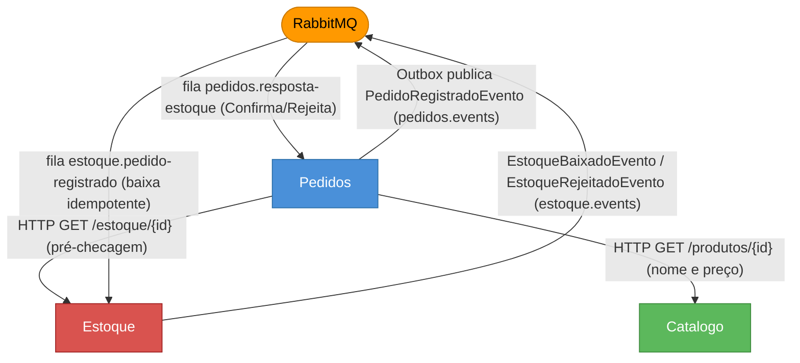

# Fluxo e Comunicação dos Microserviços

Este documento descreve como os microserviços do sistema **Gestão de Armazém Esportivo** interagem,
os protocolos utilizados e o fluxo completo da emissão de pedidos (saga).

---

## Visão Geral

Os quatro microserviços se comunicam de duas formas:

- **Síncrona** — chamadas HTTP (REST) entre serviços, com resiliência (timeout/retry/circuit breaker).
- **Assíncrona** — eventos via **RabbitMQ** (Direct Exchange), com **Transactional Outbox**,
  **consumidores idempotentes**, **Dead Letter Queues** e **propagação do contexto de trace**.

Cada serviço tem seu próprio PostgreSQL e autentica via **JWT** compartilhado. Veja as decisões em
[Decisoes.md](Decisoes.md).

---

## Grafo de Comunicação



---

## Eventos da Saga

| Evento | Publicado por | Exchange | Routing key | Fila consumidora | Consumido por |
|---|---|---|---|---|---|
| `PedidoRegistradoEvento` | Pedidos (via outbox) | `pedidos.events` | `pedidos.pedido.registrado` | `estoque.pedido-registrado` | Estoque |
| `EstoqueBaixadoEvento` | Estoque | `estoque.events` | `estoque.baixado` | `pedidos.resposta-estoque` | Pedidos |
| `EstoqueRejeitadoEvento` | Estoque | `estoque.events` | `estoque.rejeitado` | `pedidos.resposta-estoque` | Pedidos |

Cada fila possui uma **DLQ** (`<fila>.dlq`, dead-letter exchange `gestao.dlx`) para mensagens que
falharem após a reentrega. Todos os eventos carregam `idEvento` (chave de idempotência).

---

## Fluxo Completo: Emissão de Pedido (Saga)

```text
Cliente
  │  POST /pedidos  (via Gateway)
  ▼
Pedidos.Api
  ├─ HTTP GET /produtos/{id}  ───────────────► Catálogo   (nome, preço)
  ├─ HTTP GET /estoque/{id}   ───────────────► Estoque    (pré-checagem; erro imediato se faltar)
  ├─ [transação única] grava Pedido (status = Pendente) + MensagemOutbox
  └─ resposta: 201 com pedido "Pendente"

PublicadorOutbox (background, Pedidos)
  └─ publica PedidoRegistradoEvento ─────────► RabbitMQ (pedidos.events)
                                                   │
                                                   ▼
Estoque (consumidor idempotente)
  ├─ se idEvento já processado → reage de novo (sem reaplicar)
  ├─ [transação única] valida todos os itens, baixa estoque (xmin) + grava eventos_processados
  └─ publica:
       • EstoqueBaixadoEvento     (sucesso)        ─► estoque.events
       • EstoqueRejeitadoEvento   (insuficiente)   ─► estoque.events
                                                   │
                                                   ▼
Pedidos (consumidor de resposta, idempotente por estado)
  ├─ EstoqueBaixadoEvento   → Pedido.confirmar()  (status = Confirmado)
  └─ EstoqueRejeitadoEvento → Pedido.rejeitar()   (status = Rejeitado, com motivo)
```

O cliente acompanha o desfecho consultando `GET /pedidos/{id}` (status `Pendente` →
`Confirmado`/`Rejeitado`).

---

## Por que esse desenho

- **Outbox**: pedido e evento gravados atomicamente — sem *dual-write* (evento nunca se perde).
- **Saga**: o pedido só vira `Confirmado` após a baixa real — elimina venda além do disponível.
- **Idempotência** (`eventos_processados` + idempotência por estado): reentregas não causam dupla baixa.
- **`xmin`** como token de concorrência: evita *lost update* em baixas concorrentes.
- **Propagação de trace** nos cabeçalhos das mensagens: trace contínuo no Jaeger através da fila.

Detalhes e trade-offs em [Decisoes.md](Decisoes.md).

---

## Descrição dos Serviços

| Serviço | Porta | Recebe HTTP de | Publica | Consome | Banco |
|---|---|---|---|---|---|
| Identidade | 5001 | — | — | — | `identidade_db` |
| Catálogo | 5002 | Pedidos (`GET /produtos/{id}`) | — | — | `catalogo_db` |
| Estoque | 5003 | Pedidos (`GET /estoque/{id}`) | `EstoqueBaixado/Rejeitado` | `PedidoRegistrado` | `estoque_db` |
| Pedidos | 5004 | — | `PedidoRegistrado` (outbox) | `EstoqueBaixado/Rejeitado` | `pedidos_db` |

---

## Infraestrutura de Suporte

| Componente | Função |
|---|---|
| **PostgreSQL** | Banco dedicado por serviço |
| **RabbitMQ** | Broker de mensagens (saga, outbox, DLQ) |
| **OTEL Collector** | Coleta de traces e métricas (OpenTelemetry) |
| **Jaeger** | Visualização de traces distribuídos (inclui a fronteira da fila) |
| **Prometheus / Grafana** | Métricas e dashboards |
