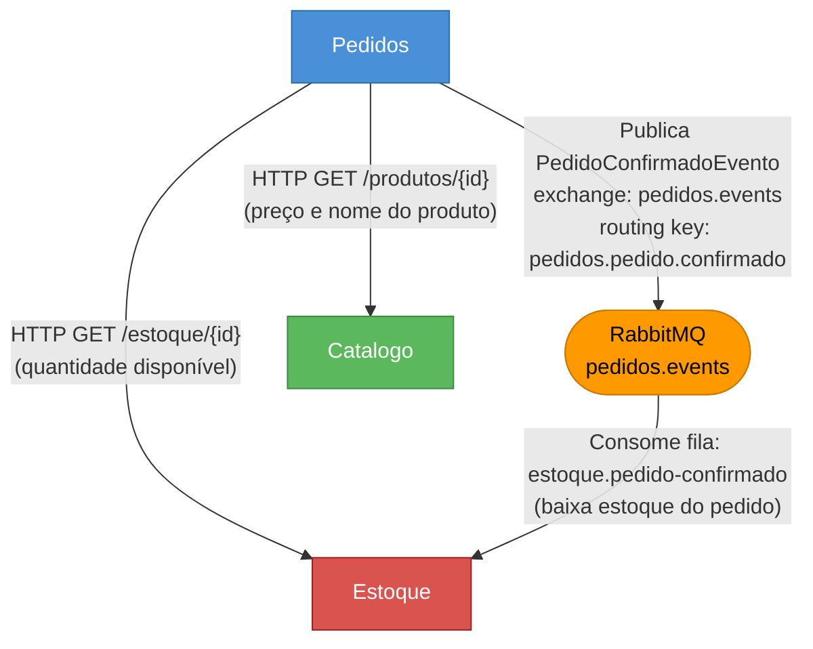

# Fluxo e Comunicação dos Microserviços

Este documento descreve como os microserviços do sistema **Gestão de Armazém Esportivo** interagem entre si, os protocolos utilizados e o fluxo completo de cada operação relevante.

---

## Visão Geral da Arquitetura

O sistema é composto por quatro microserviços independentes que se comunicam de duas formas:

- **Síncrona** — chamadas HTTP entre serviços (REST)
- **Assíncrona** — mensagens via **RabbitMQ** (padrão publish/subscribe com Direct Exchange)

Cada serviço possui seu próprio banco de dados PostgreSQL isolado e autentica requisições por meio de **JWT** compartilhado via variável de ambiente.

---

## Grafo de Comunicação

> O diagrama abaixo não inclui o Gateway (ponto de entrada externo).



---

## Descrição dos Serviços

### Identidade (`identidade-api` — porta 5001)

Responsável pelo registro e autenticação de usuários. Emite tokens **JWT** utilizados por todos os demais serviços.

- **Não recebe chamadas de outros serviços internos**
- **Não publica nem consome eventos**
- Banco: `identidade_db`

---

### Catálogo (`catalogo-api` — porta 5002)

Gerencia o cadastro de produtos (nome, descrição, preço, categoria).

- **Recebe** chamadas HTTP do serviço de **Pedidos** para consulta de produto por ID
- **Não publica nem consome eventos**
- Banco: `catalogo_db`

**Endpoints consultados por Pedidos:**

| Método | Rota | Descrição |
|--------|------|-----------|
| `GET` | `/produtos/{id}` | Retorna nome e preço do produto |

---

### Estoque (`estoque-api` — porta 5003)

Controla entradas e o saldo de estoque de cada produto.

- **Recebe** chamadas HTTP do serviço de **Pedidos** para consulta de quantidade disponível
- **Consome** o evento `PedidoConfirmadoEvento` do RabbitMQ para baixar estoque automaticamente

**Endpoints consultados por Pedidos:**

| Método | Rota | Descrição |
|--------|------|-----------|
| `GET` | `/estoque/{produtoId}` | Retorna a quantidade disponível em estoque |

**Fila RabbitMQ consumida:**

| Exchange | Routing Key | Fila | Ação |
|----------|-------------|------|------|
| `pedidos.events` | `pedidos.pedido.confirmado` | `estoque.pedido-confirmado` | Baixa o estoque de cada item do pedido confirmado |

A fila possui uma **Dead Letter Queue (DLQ)** configurada (`estoque.pedido-confirmado.dlq`) para mensagens que falharem após a segunda tentativa.

---

### Pedidos (`pedidos-api` — porta 5004)

Orquestra a emissão de pedidos. É o único serviço que inicia comunicações com outros serviços.

**Fluxo ao emitir um pedido (`POST /pedidos`):**

1. Para cada item do pedido:
   - Chama **Catálogo** (HTTP síncrono) para obter nome e preço do produto
   - Chama **Estoque** (HTTP síncrono) para verificar se há quantidade suficiente disponível
   - Retorna erro imediato se o produto não existir ou o estoque for insuficiente
2. Persiste o pedido com status `Confirmado` no banco `pedidos_db`
3. Publica o evento `PedidoConfirmadoEvento` no RabbitMQ

**Evento publicado:**

| Exchange | Routing Key | Payload |
|----------|-------------|---------|
| `pedidos.events` | `pedidos.pedido.confirmado` | `{ pedidoId, dataConfirmacao, itens: [{ produtoId, quantidade }] }` |

---

## Fluxo Completo: Emissão de Pedido

```
Cliente
  │
  │  POST /pedidos  (via Gateway)
  ▼
Pedidos.Api
  │
  ├─── HTTP GET /produtos/{id} ──────────────► Catálogo.Api
  │         ◄── { nome, preço } ─────────────┘
  │
  ├─── HTTP GET /estoque/{id} ───────────────► Estoque.Api
  │         ◄── { quantidadeDisponivel } ─────┘
  │
  ├─── [valida: estoque >= quantidade solicitada]
  │
  ├─── [persiste Pedido no PostgreSQL]
  │
  └─── Publica PedidoConfirmadoEvento ────────► RabbitMQ (pedidos.events)
                                                    │
                                                    └──► Estoque.Api (BackgroundService)
                                                              └─ baixa estoque de cada item
```

---

## Infraestrutura de Suporte

| Componente | Função |
|---|---|
| **PostgreSQL** | Banco de dados dedicado por serviço |
| **RabbitMQ** | Broker de mensagens para comunicação assíncrona |
| **OTEL Collector** | Coleta de traces e métricas via OpenTelemetry |
| **Jaeger** | Visualização de traces distribuídos |
| **Prometheus** | Coleta e armazenamento de métricas |
| **Grafana** | Dashboards de observabilidade |
