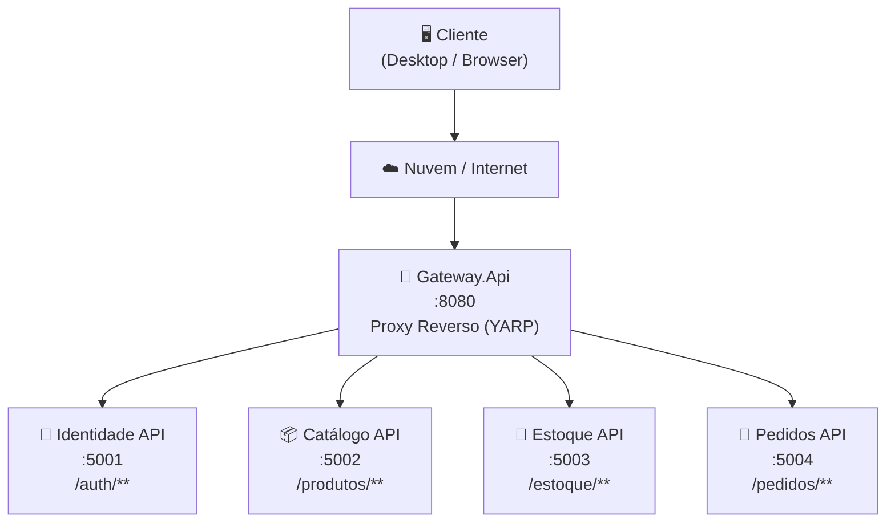
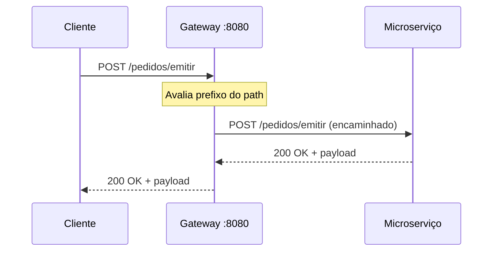

# Gateway — Proxy Reverso

O **Gateway.Api** é o ponto de entrada único do sistema. Implementado com [YARP (Yet Another Reverse Proxy)](https://microsoft.github.io/reverse-proxy/), ele recebe todas as requisições externas e as encaminha ao microserviço correspondente com base no prefixo do path.

---

## Arquitetura



> Nenhuma API interna é exposta diretamente para o exterior. Todo o tráfego passa pelo Gateway na porta **8080**.

---

## Rotas Configuradas

| Prefixo do Path | Cluster de Destino   | Serviço            | Porta Interna |
|-----------------|----------------------|--------------------|---------------|
| `/auth/**`      | `identidade-cluster` | Identidade API     | 8080          |
| `/produtos/**`  | `catalogo-cluster`   | Catálogo API       | 8080          |
| `/estoque/**`   | `estoque-cluster`    | Estoque API        | 8080          |
| `/pedidos/**`   | `pedidos-cluster`    | Pedidos API        | 8080          |

---

## Implementação

O Gateway é um projeto ASP.NET Core mínimo — sem controllers ou lógica de negócio. Toda a configuração de roteamento fica em `appsettings.json` na seção `ReverseProxy`.

**`Program.cs`**

```csharp
var builder = WebApplication.CreateBuilder(args);

builder.Services.AddReverseProxy()
    .LoadFromConfig(builder.Configuration.GetSection("ReverseProxy"));

var app = builder.Build();

app.MapReverseProxy();
app.Run();
```

**Estrutura da configuração (`appsettings.json`)**

```json
{
  "ReverseProxy": {
    "Routes": {
      "<nome-da-rota>": {
        "ClusterId": "<cluster-alvo>",
        "Match": { "Path": "/<prefixo>/{**catch-all}" }
      }
    },
    "Clusters": {
      "<cluster-alvo>": {
        "Destinations": {
          "primary": { "Address": "http://<servico>:8080" }
        }
      }
    }
  }
}
```

---

## Fluxo de uma Requisição



---

## Tecnologias

| Componente | Detalhe |
|---|---|
| Runtime | .NET 9 |
| Biblioteca de proxy | YARP 2.x (`Yarp.ReverseProxy`) |
| Configuração | `appsettings.json` (sem código extra) |
| Containerização | Docker (porta externa `8080`) |
